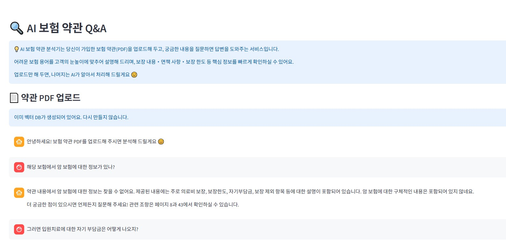

# 📑 AI 보험 약관 분석기 (RAG 기반 PDF Q&A)


사용자가 **자신의 보험 약관 PDF**를 업로드하면, 약관 내용을 벡터DB로 변환하고
**자연어로 질문을 던지면 챗봇 형식으로 답변**해 주는 Streamlit 애플리케이션입니다.

보험 약관의 어려운 용어와 구조를 고객의 눈높이에 맞게 풀어서 설명해 주며,

* 보장 내용
* 면책 사항
* 보장 한도

같은 핵심 내용을 빠르게 찾아볼 수 있도록 도와줍니다.

---

## 🧩 주요 기능

* 📄 **PDF 업로드**

  * 사용자가 보험 약관 PDF를 업로드하면 서버 내 임시 파일로 저장 후 로딩
* ✂️ **텍스트 분할 (Chunking)**

  * `RecursiveCharacterTextSplitter`를 사용해 약관을 일정 길이의 청크로 분할
* 🧠 **벡터DB 생성 (FAISS)**

  * `OpenAIEmbeddings`로 임베딩 생성
  * `FAISS` 기반 Vector Store 생성
* 🔍 **RAG(Retrieval-Augmented Generation) 기반 Q&A**

  * 업로드된 약관 내용에서 관련된 문서를 검색하여 LLM에 컨텍스트로 제공
  * LangChain의 `Runnable` 체인으로 RAG 파이프라인 구성
* 💬 **챗봇 UI (Streamlit)**

  * `st.chat_message`, `st.chat_input`을 활용한 대화형 인터페이스
  * 세션 상태에 대화 기록(`chat_history`)과 벡터스토어(`vectorstore`) 저장
* ⚡ **벡터DB 캐싱**

  * `@st.cache_resource`를 통해 PDF → VectorDB 빌드를 캐싱하여 성능 최적화

---

## 🏗️ 기술 스택

* **Python**
* **Streamlit**
* **LangChain**

  * `PyPDFLoader`
  * `RecursiveCharacterTextSplitter`
  * `FAISS`
  * `OpenAIEmbeddings`
  * `ChatOpenAI`
  * `RunnablePassthrough`, `RunnableParallel`, `RunnableLambda`
* **OpenAI API**
* **환경변수 관리:** `python-dotenv`

---

## 💻 사용 방법

1. 앱 접속 후 상단에 **"🔍 AI 보험 약관 Q&A"** 화면이 표시됩니다.
2. **보험 약관 PDF 업로드** 영역에서 PDF 파일을 선택합니다.
3. **"약관 분석 시작하기"** 버튼을 클릭하면:

   * PDF를 읽어와 텍스트를 분할하고
   * OpenAI 임베딩을 생성한 뒤
   * FAISS 벡터DB를 생성합니다. (최초 1회)
4. 벡터DB 생성이 완료되면 채팅 입력창에 예를 들어 다음과 같이 질문할 수 있습니다.

   * `이 보험에서 암 진단비는 얼마나 보장되나요?`
   * `면책 기간이 어떻게 되나요?`
   * `상해 입원에 대한 보장 한도를 알려주세요.`
5. AI가 약관 내용에서 관련 조항을 찾아 **쉽고 친절한 설명**으로 답변해 줍니다.
   답변 마지막에는 “제 ○조”, “○페이지” 등의 근거도 함께 제시하도록 설계되어 있습니다.

---

## 🧠 RAG 프롬프트 컨셉

시스템 프롬프트는 다음과 같은 원칙을 따릅니다.

* 역할: **“보험 약관을 고객 눈높이에서 설명해주는 AI 보험 가이드”**
* 톤: 딱딱한 법률 문장 대신, 부드럽고 친절한 설명
* 사실성:

  * 반드시 컨텍스트(약관 내용)에 기반해서만 답변
  * 없으면 **“약관 내용에서 찾을 수 없어요”**라고 안내
* 출처:

  * 답변 마지막에 관련 조항(제 몇 조) 또는 페이지 정보를 언급
* 대상: 성인이지만, 보험에 익숙하지 않은 사람 기준으로 쉽게 설명

---

## 📁 프로젝트 구조 (예시)

```text
.
├── app.py           # 본 README가 설명하는 Streamlit 앱
├── README.md        # 이 파일
└── .env             # OpenAI API 키 등 환경변수 (gitignore 권장)
```

`.env` 파일과 같은 민감 정보는 **반드시 `.gitignore`에 추가**해 주세요.

예시:

```gitignore
.env
*.pyc
__pycache__/
```

---

## ⚠️ 주의 사항

* 이 앱은 **업로드된 PDF의 내용에만 의존**합니다.
  약관에 없는 내용은 답변하지 않도록 설계되어 있으나,
  실제 법률/재정적 판단이 필요한 경우에는 반드시 **전문가와 상담**해야 합니다.
* OpenAI API 사용에 따른 비용이 발생할 수 있으니,
  과도한 호출이나 불필요한 테스트는 주의해 주세요.

---

## 🔮 앞으로 확장 아이디어

* 여러 개의 보험 약관 PDF를 동시에 관리하고, 약관별로 선택해서 질답하기
* 질문별로 사용된 **원문 조항 하이라이트** 기능 추가
* 사용자별 약관 히스토리 관리 (세션 저장소/DB 연동)
* 모바일 화면 최적화 UI 튜닝

---

원하는 방향이나 추가 기능이 있으면, 이 README에 “기능 추가” 섹션을 따로 만들어서 적어 두는 것도 좋습니다.
필요하면 `requirements.txt` 초안도 같이 만들어 줄게요.
